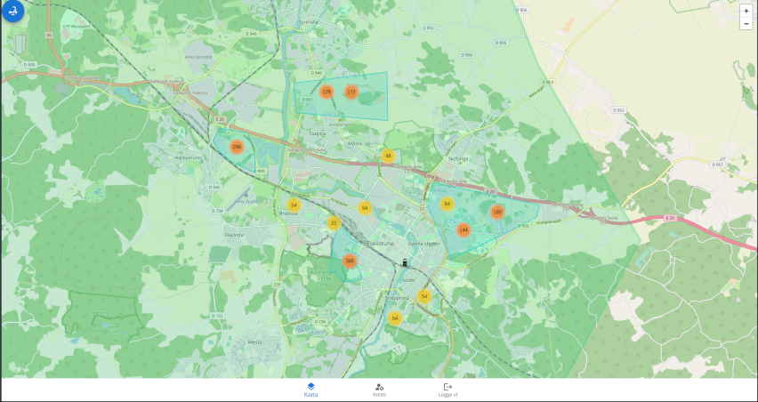

# How to use this repository

[](https://scrutinizer-ci.com/g/virtuella-team/vteam/?branch=main)
[](https://scrutinizer-ci.com/g/virtuella-team/vteam/build-status/main)

## Getting started with the project

1. Clone the repo.

1. Create an .env in the root of the repo and copy the contents from .env.example
   and fill in the blanks.

1. Create an .env in `customerapp/` and add your github client id for Oauth.

   ```bash
   REACT_APP_GITHUB_CLIENT_ID=
   REACT_APP_GITHUB_REDIRECT=http://localhost:5200/
   ```

1. Start the docker images

   ```bash
   docker-compose up --build
   ```

1. With the images running the clients are accessed by:

   - Admin client [localhost:5100](http://localhost:5100)
     - login with email@example.com
     - password 12345678
   - User client [localhost:5200](http://localhost:5200)
     - login with github oauth

1. To start the simulation with 4500 scooters.

   ```bash
   docker exec -it bike-brain2 bash -c "python3 main.py"

   ```

   
   

1. Misc
   - [API documentation @ postman](https://www.postman.com/grey-desert-944094/workspace/vteam-8/collection/24625188-0cbaee60-493f-4d98-b655-87160d21dc98?action=share&creator=24625188)
